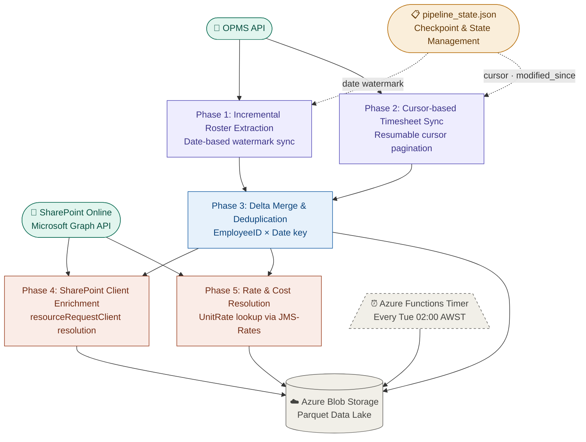

# Timesheet Pipeline — Azure Blob Edition

Stateful incremental ETL pipeline with cursor/date checkpoint recovery.

Pulls workforce data from OPMS, enriches with SharePoint contract and rate data, and persists results as Parquet to Azure Blob Storage — fully automated on a weekly schedule via Azure Functions.

---

## Pipeline Architecture



| Phase | Description | Output |
|-------|-------------|--------|
| 1 | Incremental roster extraction with date watermark | `data/roster.parquet` |
| 2 | Cursor-based timesheet sync with resumable pagination | `data/timesheet.parquet` |
| 3 | Delta merge and deduplication on `EmployeeID × Date` key | `data/merged.parquet` |
| 4 | SharePoint client enrichment via Graph API | `data/merged.parquet` |
| 5 | Rate and cost resolution via JMS-Rates lookup | `data/merged.parquet` |

---

## Features

- Incremental roster synchronization with date-based watermark
- Cursor-based timesheet ingestion with resumable pagination
- Stateful pipeline recovery via checkpoint persistence
- SharePoint client enrichment via Microsoft Graph API
- Delta merge deduplication on composite key
- Azure Blob Parquet persistence (columnar data lake)
- Automated scheduled execution via Azure Functions
- Cloud-native ETL architecture with no local state dependency

---

## Architecture Stack

| Layer | Technology |
|-------|-----------|
| Runtime | Python 3.11 |
| Orchestration | Azure Functions (Timer Trigger) |
| Cloud Storage | Azure Blob Storage |
| Data Format | Apache Parquet (PyArrow) |
| Enrichment API | Microsoft Graph API / SharePoint Online |
| Source API | OPMS REST API |
| Data Processing | Pandas |
| State Management | JSON checkpoint on Azure Blob |
| Pipeline Pattern | Incremental ETL / Stateful Sync |

---

## Checkpoint & State Management

All pipeline state is persisted to `config/pipeline_state.json` on Azure Blob. On each run the pipeline reads state, resumes from the last known position, and writes updated state on completion — enabling full recovery from any mid-run failure.

```json
{
  "roster_last_end":           "2026-05-25",
  "timesheet_cursor":          null,
  "timesheet_fetched_count":   0,
  "timesheet_modified_since":  "2026-05-25T00:00:00Z",
  "updated_at":                "2026-05-25 02:00:03 AWST"
}
```

| Field | Purpose |
|-------|---------|
| `roster_last_end` | Date watermark — next run starts from +1 day |
| `timesheet_cursor` | API pagination cursor — resumes mid-fetch on failure |
| `timesheet_modified_since` | Incremental window — advances to today after full fetch |
| `updated_at` | Perth AWST timestamp of last successful write |

---

## Project Structure

```
├── function_app.py          # Azure Functions entry point (Timer Trigger)
├── host.json                # Azure Functions host configuration
├── main.py                  # Pipeline orchestrator
├── Roster+timesheet+com.py  # OPMS API: roster + timesheet extraction
├── Sharepoint_contracts.py  # Graph API: client enrichment
├── Sharepoint_Rates.py      # Graph API: rate & cost resolution
├── requirements.txt         # Python dependencies
├── .env                     # Local secrets (not committed)
└── .gitignore
```

---

## Environment Variables

```env
# OPMS
OPMS_CLIENT_ID=
OPMS_CLIENT_SECRET=

# Azure Blob
AZURE_STORAGE_CONNECTION_STRING=
AZURE_BLOB_CONTAINER=timesheethour

# SharePoint / Microsoft Graph
SHAREPOINT_TENANT_ID=
SHAREPOINT_CLIENT_ID=
SHAREPOINT_CLIENT_SECRET=
SHAREPOINT_HOST=
SITE_NAME=
GAP_LIST_NAME=JMS-Jobs
LIST_NAME=JMS-Projects
LIST_NAME1=JMS-Rates
```

---

## Setup

```bash
pip install -r requirements.txt
```

---

## Usage

```bash
# Run full pipeline
python main.py

# Run a specific phase
python main.py --phase roster
python main.py --phase timesheet
python main.py --phase merge
python main.py --phase resolve
python main.py --phase rates

# Upload Project_Client_Map.csv to Blob (one-time setup)
python main.py --upload-map Project_Client_Map.csv
```

---

## Azure Functions Deployment

Triggered every **Tuesday 02:00 AWST** (UTC Monday 18:00).

```bash
az functionapp deployment source config \
  --name <your-function-app> \
  --resource-group <your-rg> \
  --repo-url https://github.com/Pearlluo/UpdateTimesheet-Projects-Rates- \
  --branch main \
  --manual-integration
```

Set all environment variables under **Function App → Configuration → Application Settings**.

---

## Blob Storage Layout

```
timesheethour/
├── data/
│   ├── roster.parquet          ← Raw roster (incremental append)
│   ├── timesheet.parquet       ← Raw timesheets (incremental append)
│   └── merged.parquet          ← Enriched output (Power BI source)
└── config/
    ├── pipeline_state.json     ← Checkpoint & state management
    └── Project_Client_Map.csv  ← Manual project-to-client mapping
```
