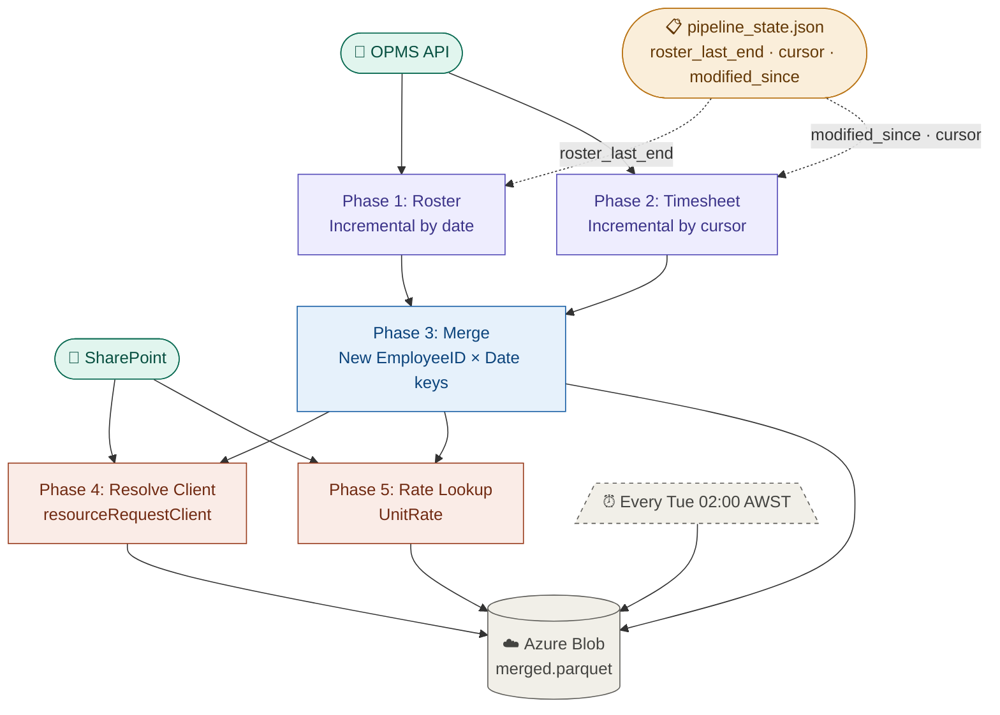

# Timesheet Pipeline — Azure Blob Edition

Automated pipeline that pulls timesheet and roster data from OPMS, resolves project clients via SharePoint, matches unit rates, and stores results in Azure Blob Storage.

---

## Pipeline Overview



| Phase | Description | Output |
|-------|-------------|--------|
| 1 | Fetch roster from OPMS (incremental by date) | `data/roster.parquet` |
| 2 | Fetch timesheets from OPMS (incremental by cursor) | `data/timesheet.parquet` |
| 3 | Merge roster + timesheet (incremental by key) | `data/merged.parquet` |
| 4 | Resolve `resourceRequestClient` via SharePoint | `data/merged.parquet` |
| 5 | Look up `UnitRate` via SharePoint JMS-Rates | `data/merged.parquet` |

---

## Incremental Strategy

State is stored in `config/pipeline_state.json` on Azure Blob:

```json
{
  "roster_last_end":           "2026-05-25",
  "timesheet_cursor":          null,
  "timesheet_fetched_count":   0,
  "timesheet_modified_since":  "2026-05-25T00:00:00Z",
  "updated_at":                "2026-05-25 02:00:03 AWST"
}
```

- **Roster**: pulls from `roster_last_end + 1 day` to today
- **Timesheet**: uses `modified_since` to pull only changed records; advances to today after each full fetch
- **Merge**: only reprocesses new `(EmployeeID, Date)` keys
- **Resolve / Rates**: skips rows that already have values

---

## Project Structure

```
├── function_app.py          # Azure Functions entry point (Timer Trigger)
├── host.json                # Azure Functions configuration
├── main.py                  # Main pipeline orchestrator
├── Roster+timesheet+com.py  # OPMS API: roster + timesheet fetch
├── Sharepoint_contracts.py  # SharePoint: resolve resourceRequestClient
├── Sharepoint_Rates.py      # SharePoint: look up UnitRate
├── requirements.txt         # Python dependencies
├── .env                     # Local environment variables (not in git)
└── .gitignore
```

---

## Environment Variables

Create a `.env` file locally (never commit this):

```env
# OPMS
OPMS_CLIENT_ID=
OPMS_CLIENT_SECRET=

# Azure Blob
AZURE_STORAGE_CONNECTION_STRING=
AZURE_BLOB_CONTAINER=timesheethour

# SharePoint
SHAREPOINT_TENANT_ID=
SHAREPOINT_CLIENT_ID=
SHAREPOINT_CLIENT_SECRET=
SHAREPOINT_HOST=
SITE_NAME=
GAP_LIST_NAME=JMS-Jobs
LIST_NAME=JMS-Projects
LIST_NAME1=JMS-Rates
```

---

## Setup

```bash
pip install -r requirements.txt
```

---

## Usage

```bash
# Run full pipeline
python main.py

# Run a specific phase only
python main.py --phase roster
python main.py --phase timesheet
python main.py --phase merge
python main.py --phase resolve
python main.py --phase rates

# Upload Project_Client_Map.csv to Blob (one-time setup)
python main.py --upload-map Project_Client_Map.csv
```

---

## Azure Functions Deployment

Triggered every **Tuesday 02:00 AWST** (Monday 18:00 UTC).

Deploy via Azure CLI:

```bash
az functionapp deployment source config \
  --name <your-function-app> \
  --resource-group <your-rg> \
  --repo-url https://github.com/Pearlluo/UpdateTimesheet-Projects-Rates- \
  --branch main \
  --manual-integration
```

Set all environment variables under **Function App → Configuration → Application Settings**.

---

## Blob Storage Structure

```
timesheethour/
├── data/
│   ├── roster.parquet
│   ├── timesheet.parquet
│   └── merged.parquet          ← Final output (used by Power BI)
└── config/
    ├── pipeline_state.json     ← Incremental state / checkpoints
    └── Project_Client_Map.csv  ← Manual project → client mapping
```
